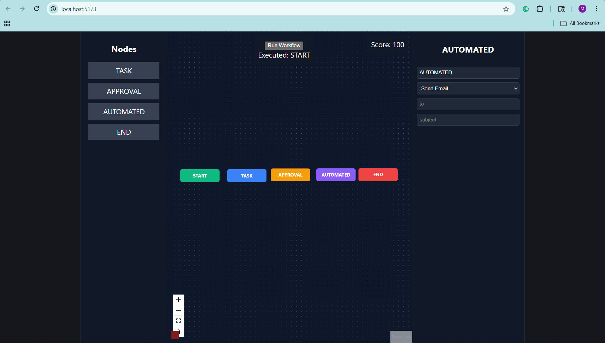

# 🚀 FlowMind — Intelligent Workflow Builder



> A visual workflow designer built using React Flow that enables dynamic configuration, validation, and simulation of complex workflows.

---

## ⚡ Why this stands out

* Designed a **graph-based workflow engine**
* Built **dynamic node forms** with conditional rendering
* Implemented **simulation system** using traversal logic
* Added **real-time validation + scoring**
* Created **extensible architecture for new node types**

---

## 🔥 Features

* 🧠 Drag & Drop node creation
* 🔗 Visual graph connections
* ⚙️ Dynamic configuration panel (node-specific forms)
* 🤖 API-driven automated nodes (dynamic parameters)
* ▶️ Workflow simulation engine
* ✅ Real-time validation + scoring
* ❌ Cycle detection + error handling

---

## 🧩 Node Types

* 🟢 **Start Node** — Entry point with metadata
* 🔵 **Task Node** — Description, assignee, due date
* 🟡 **Approval Node** — Role + threshold
* 🟣 **Automated Node** — API-based dynamic actions
* 🔴 **End Node** — Summary + completion flag

---

## 🧪 Simulation Engine

* Traverses workflow graph starting from the Start node
* Executes nodes step-by-step based on connections
* Prevents infinite loops using cycle detection
* Displays execution logs in real-time

---

## ⚠️ Validation System

* Detects:

  * Missing Start / End nodes
  * Disconnected nodes
  * Cycles in workflow graph
* Generates a real-time **workflow score**

---

## 🛠 Tech Stack

* **Frontend:** React (Vite)
* **Graph Engine:** React Flow
* **Language:** JavaScript (ES6+)
* **API Layer:** Custom Mock API

---

## 📁 Project Structure

```
src/
├── components/
│   ├── FlowCanvas.jsx
│   ├── Sidebar.jsx
│   ├── ConfigPanel.jsx
│   ├── SimulationPanel.jsx
│   └── CustomNode.jsx
│
├── services/
│   └── api.js
│
├── utils/
│   └── validation.js
│
└── App.jsx
```

---

## ⚡ Run Locally

```bash
git clone https://github.com/Manas20008/flowmind-workflow-builder.git
cd flowmind-workflow-builder
npm install
npm run dev
```

---

## 🧠 Key Engineering Decisions

* Centralized workflow state (nodes + edges)
* Config-driven node rendering for scalability
* Modular validation and simulation engines
* Separation of UI, business logic, and API layers

---

## 🚀 Future Scope

* Export / Import workflows (JSON)
* Backend persistence
* Real-time collaboration
* Node templates and reusable workflows

---

## 👨‍💻 Author

**Manas Mahajan**

* GitHub: https://github.com/Manas20008
* LinkedIn: https://www.linkedin.com/in/manas-mahajan-12b0062b2/

---

⭐ If you like this project, consider giving it a star!
